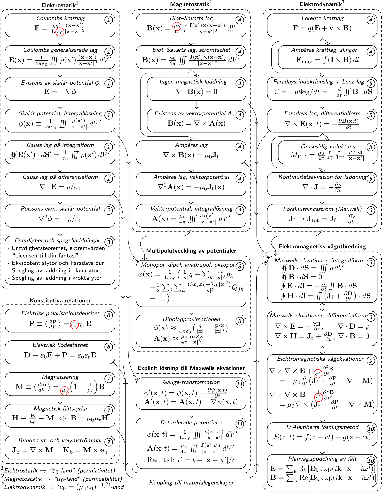

# "World Map of Classical Electromagnetics"

This repository contains the source for a "world map" of the principal theorems
and relations in classical electromagnetics. The map is compiled in order to
assist the students in grasping the "helicopter picture" of the sometimes
confusing but nevertheless strictly ordered and logical field of electrostatics,
magnetostatics and electrodynamics.

The map is by no means intended to be complete in any respect, but rather to
summarize the principal relations in a single page.

## Files of interest

[`worldmap.pdf`](worldmap.pdf) <i>The compied World Map of Classical
         Electromagnetics in PDF format.</i>

[`figs/worldmap.mp`](figs/worldmap.mp) <i>MetaPost source code for the
         World Map of Classical Electromagnetics.</i>

[`figs/worldmap.eps`](figs/worldmap.eps) <i>The
         World Map of Classical Electromagnetics in EPS (Encapsulated
	 PostScript) format.</i>

[`figs/worldmap.svg`](figs/worldmap.svg) <i>The
         World Map of Classical Electromagnetics in SVG (Scalable
	 Vector Graphics) format.</i>

[`figs/worldmap.png`](figs/worldmap.png) <i>The
         World Map of Classical Electromagnetics in PNG (Portable
	 Network Graphics) format.</i>

## The World Map of Classical Electromagnetics

## Contributing

Reports on errors, inconsistencies or improvements in general are most welcome!

## Compiling the TeX code and figures

In the present directory, the included `Makefile` can be used to regenerate the
entire "world map" of classical electromagnetism. Just run `make` and ensure to
install any missing components in case there are any complaints.

## Copyright
Copyright (C) 2026, Fredrik Jonsson, under GPL 3.0.
